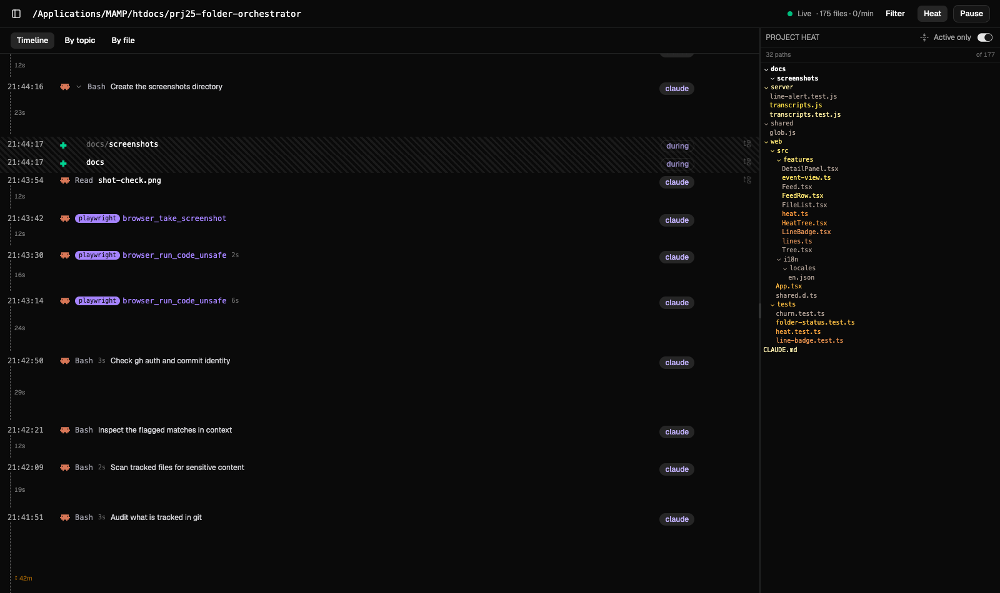
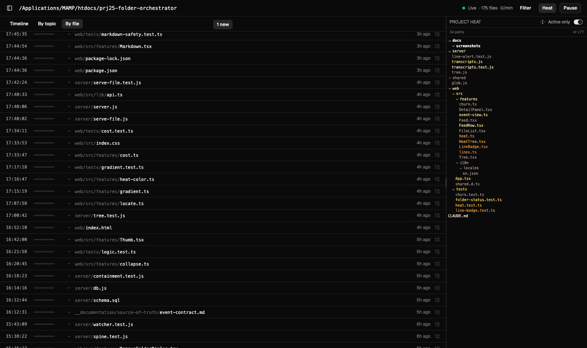
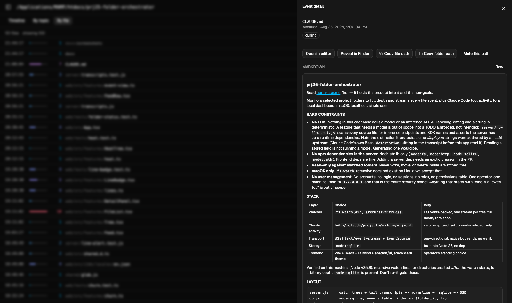

# Folder Orchestrator

**"Where is Claude Code right now — and is the loop actually doing what I asked?"**

I kept asking myself that. You set an agent running, it goes quiet for twenty minutes, and the
terminal scrolls past faster than anyone reads. Is it still on the task I gave it, or has it been
rewriting test fixtures for the last ten minutes? Which files has it actually touched? Is it
*working*, or is it stuck in a loop repairing something it broke three steps ago?

I could never answer that without stopping the run and going digging. So I built the thing that
answers it while the work is still happening.

Point it at your project folders. It watches every file to full depth, reads Claude Code's own
transcripts, and joins the two — so at any moment you can see what the agent is doing *now*, what
it has changed, what you asked it for, and what it has cost.

macOS, localhost, one operator. No LLM anywhere in it.



---

## What it actually answers

**"Where is it right now?"** — the currently running tool call, with a live counter of how long it
has been going, and a pulse on the specific files being written. Long gaps show up as measured
vertical distance between rows, so a stall looks like a stall instead of looking like nothing.

**"Is it doing what I asked?"** — every action is filed under your prompt, taken verbatim from the
transcript. If the agent has wandered off the task, the topic it is filed under says so.

**"What has it touched?"** — the project tree, brightest where work just landed, so drift into an
unexpected corner of the repo is visible as a bright branch somewhere you were not expecting one.

**"Is it stuck in a loop?"** — files ranked by *how many times* they changed. A file being rewritten
eleven times is telling you something a file written once is not.

**"What did that cost?"** — token usage per task, read from the transcript, joined to the prompt.

---

## Why it works this way

Two records exist of any agent session, and they disagree. The terminal tells you what the agent
*said* it did. The filesystem knows what actually landed. The gap between them is exactly where the
surprises live — the formatter that rewrote forty files, the test run that regenerated a fixture,
the edit to a file nobody mentioned.

Nothing I tried closed that gap. A file watcher tells you a path changed but not who changed it. The
agent's log tells you what it intended but not what happened. Git tells you the end state, after the
fact, once it is too late to intervene. This sits in the middle: **the filesystem's record and the
agent's record, joined on time, shown live.**

And it does that without asking a model anything. A lot of "observability" tooling answers questions
by having an LLM summarise them — expensive, non-deterministic, and for *"which files just changed"*
entirely unnecessary. The filesystem already knows. This is a joining and rendering problem, not an
inference problem, and the whole project is an argument that treating it that way gets you a better
answer for free.

## Hard constraints

These are design commitments, not aspirations. Each is enforced by a test.

| Constraint | Why | How it's enforced |
|---|---|---|
| **Zero LLM** | Every label, diff and alert is deterministic and reproducible. A feature that needs a model is out of scope, not a TODO. | `server/no-llm.test.js` scans every source file for inference endpoints and SDK names, and asserts the server has zero runtime dependencies |
| **Zero server dependencies** | Node stdlib only — `node:fs`, `node:http`, `node:sqlite`, `node:path`. Frontend deps are fine. | asserted in the same test |
| **Read-only against watched folders** | It never writes, moves or deletes inside a tree it is watching | — |
| **No user management** | No accounts, no login, no roles. One operator, one machine, bound to `127.0.0.1`. That is the entire security model. | — |

Note a distinction the no-LLM rule protects: some *displayed* strings were authored by a model
upstream — Claude Code writes its own `description` for each Bash call, and that text is sitting in
the transcript before this app ever reads it. Reading a stored field is not running a model.
Generating one would be.

## What it does

### Attribution is a join, not a guess

The filesystem does not record who wrote a file. So a row is labelled `claude` **only** when a
transcript tool call names that exact path. Everything else is honest about being weaker:

| label | what is actually known |
|---|---|
| `claude` | a tool call declared this exact path in its input — `Edit`, `Write`, `Read`. A hard join. |
| `during` | the change landed inside a call's **measured** `[start, start+duration]` window. A Claude call was running; we do not claim it was *that* call's doing. |
| *(none)* | nothing was in flight. Your editor, a formatter, `git checkout`. |

This split exists because of a measurement: **only about 7% of Claude tool calls name a file.**
`Edit`/`Write`/`Read` carry `file_path`; `Bash` carries none and is the overwhelming majority. Before
the `during` label existed, 220 of 221 filesystem events were labelled `external` — the dashboard was
telling you a human made changes the agent had just made.

`during` never upgrades to `claude`. Co-occurrence is not causation, and when several calls are in
flight at once the label still stands while the parent pointer is dropped — *"a call was running"*
stays true with N candidates; *"this call did it"* does not.

### Three views over the same events

**Timeline** — chronological, with vertical dashes measuring the real seconds between rows, so
waiting is visible as height. Filesystem rows nest under the tool call whose measured interval
contained them. Rows that cost no tokens are hatched.

**By topic** — grouped under the operator's prompt, taken verbatim from the transcript and sliced by
character count, never by meaning.

**By file** — every file in the project ranked by last change, shaded by *how often* it changed.
Files this tool never witnessed changing still appear, ranked by the filesystem's own mtime, with a
dash rather than a zero: we are not claiming they never changed, only that we did not see it.



### A heat map of where work is happening

The right column is the project tree, brightest where work just landed. Heat is measured in
**events ago, not seconds** — nothing decays on a timer, so a branch dims only because *other*
branches changed. A project left alone overnight looks exactly as it did when work stopped, and
brightness always answers *"what is being worked on"* rather than *"how long ago was this"*.

A wholesale directory appearing is treated as one thing happening, not N things. Creating a git
worktree inside a watched folder wrote 500 files in a second; stamping each one lit 202 paths and
the map started answering "what was checked out" instead.

### The detail panel

Click any row for the diff, the command, the token cost, and — for markdown files — a rendered
preview. Diffs come from two places, because most files need the second: `Edit` tool calls carry
their own `old_string`/`new_string`, and everything else asks git.



### Token accounting

Every assistant record in the transcript carries a `message.usage` block. Joined to the topic
already being tracked, that answers *"which task cost the most"* with no extra instrumentation and
no estimation.

One counter-intuitive result that falls out of it: **wall time is free.** A 90-second test run bills
exactly what a 0.1-second one does, because nothing accrues while a command executes. For Python
calls specifically, measured across 4,692 of them, the *command text* cost about 4× the output — the
expensive part is the script being written, not running it.

## Stack

| Layer | Choice | Why |
|---|---|---|
| Watcher | `fs.watch(dir, {recursive: true})` | FSEvents-backed, one stream per tree, full depth, zero deps |
| Agent activity | tail `~/.claude/projects/<slug>/*.jsonl` | zero per-project setup, works retroactively |
| Transport | SSE (`text/event-stream` + `EventSource`) | one-directional, native at both ends, no websocket library |
| Storage | `node:sqlite` | built into Node 25 |
| Frontend | Vite + React + Tailwind + shadcn/ui | stock dark theme, no custom tokens |

**macOS only.** `fs.watch` recursive does not exist on Linux, and this leans on it entirely.

## Running it

Requires **Node 25+** (for `node:sqlite`) and macOS.

```bash
npm --prefix web install
npm --prefix web run build
ORCH_DB=data/live.db npm start
```

Then open <http://127.0.0.1:4000> and add a folder. `ORCH_PORT` overrides the port.

```bash
npm test          # server + web
```

## Things that were harder than they looked

A partial list, kept because each one cost real time and the reasoning is in
[CLAUDE.md](CLAUDE.md) in full:

- **macOS only reports `rename` and `change`.** Neither means what it says — you have to `stat()`
  the path to decide created / modified / deleted, and a missing path means deleted.
- **Rename detection must key on the inode,** never the basename. An inode reappearing at a
  different path *is* a rename, which is why the 500ms pairing window is safe to widen.
- **Ignore rules are load-bearing.** A real project here is 21,734 files; 14,978 excluding
  `node_modules` and `.git`. Filtering has to happen before the event reaches SQLite or SSE.
- **Editors fire event storms.** One save is often a temp file plus a rename.
- **Repeated events are real, not a bug.** A tool that writes then formats a file emits two genuine
  events ~200ms apart. The feed collapses them into one row carrying a count — the count is what
  makes the repetition visible.
- **Markdown from a watched folder is untrusted input.** A watched tree can be any repo you cloned,
  and markdown permits embedded HTML. `react-markdown` drops raw HTML unless `rehype-raw` is added,
  so the safe behaviour is the default one — and the control is a test asserting that plugin is
  absent from `package.json`.
- **`/api/file` is an allow-list,** never a deny-list, and the symlink check realpaths *both* sides:
  on macOS the folder itself often sits under a symlink (`/var` → `/private/var`), and comparing a
  resolved file against an unresolved root rejects everything legitimate.

## Status

Working and in daily use, but built for one operator on one machine. There is no auth, no
multi-user story, and no Linux support — all three by design rather than omission. The screenshots
above are the tool watching its own repository while this README was being written.
