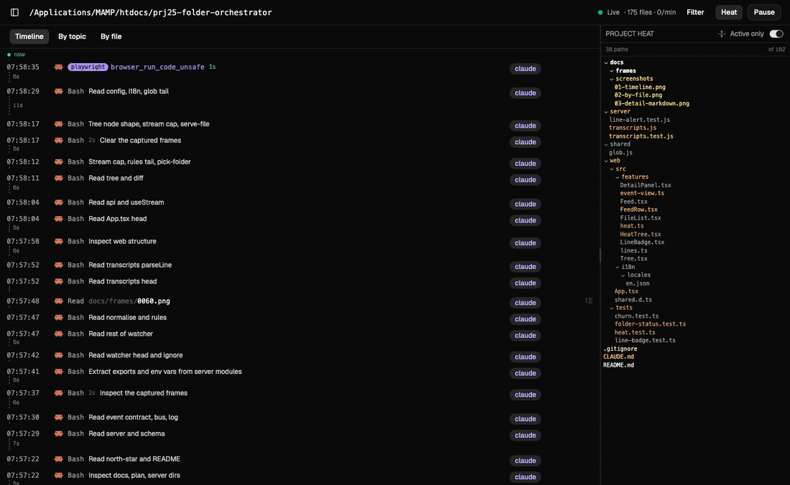

# Folder Orchestrator

**Make Claude Code's work visible. A control view over autonomous agent work.**

Coding agents no longer run one instruction at a time while you watch. You hand over a task and they
go — spawning sub-agents, working in parallel worktrees, running for twenty minutes across a dozen
files. Delegation is the whole point. Losing sight of the work is the price, and nobody agreed to
pay it.

The question I kept asking, and could never answer without stopping the run and going digging:
**where is it right now, and is the loop still doing what I asked?** Is it on the task, or has it
spent ten minutes rewriting test fixtures? Which files has it actually touched? Is it making
progress, or repairing something it broke three steps ago?

A terminal cannot answer that. A terminal is a transcript — it scrolls, it reports what the agent
*says* it is doing, and it shows you one session at a time. What supervision needs is a view: every
watched project at once, live, with ground truth underneath it.

That is what this is. Point it at your project folders and it watches every file to full depth,
reads Claude Code's own transcripts, and joins the two — so at any moment you can see what is
running, what it has changed, what you asked for, and what it has cost. Several projects at once,
each with its own live event rate, so parallel agent work is one glance rather than four terminals.

The ground truth matters more than it sounds. An agent's log tells you what it *intended*. The
filesystem knows what actually landed. When those disagree — and they do — this shows you the
second one.

macOS, localhost, one operator. No LLM anywhere in it.



*Live feed, hover-to-locate a file in the project tree, every file ranked by last change, and a
markdown document rendered on click. Recorded against this repository while it was being written.*

---

## What it answers

**"Where is it right now?"** — the running tool call, with a live counter of how long it has been
going and a pulse on the specific files being written. Gaps are drawn as measured vertical distance,
so a stall looks like a stall rather than like nothing.

**"Is it still on task?"** — every action is filed under your prompt, verbatim from the transcript.
Drift shows up as work accumulating under a topic you finished with.

**"Where has it gone?"** — the project tree, brightest where work just landed. An agent wandering
into an unexpected corner of the repo is a bright branch somewhere you were not expecting one.

**"Is it looping?"** — files ranked by *how many times* they changed. A file rewritten eleven times
is telling you something a file written once is not.

**"What did it just write?"** — click any markdown file and read it rendered, instantly, the moment
it lands. Agents write plans, specs, epics and task breakdowns as `.md` before they write any code,
and that document is the thing worth reading — it is where you find out whether the agent understood
the job. Reading it should not mean leaving the dashboard, finding the path, and opening an editor.
Tables, headings and code blocks render properly; a Raw toggle shows the source when the syntax is
what you are checking.

**"What did it cost?"** — token usage per task, read from the transcript and joined to the prompt.

---

## Why it works this way

Two records exist of any agent session, and they disagree. The terminal has what the agent said it
did. The filesystem has what landed. The gap between them is where the surprises live — the
formatter that rewrote forty files, the test run that regenerated a fixture, the edit to a file
nobody mentioned.

Nothing I tried closed that gap. A file watcher tells you a path changed but not who changed it. The
agent's own log tells you what it intended but not what happened. Git tells you the end state, after
the fact, once it is too late to intervene. This sits in the middle: **the filesystem's record and
the agent's record, joined on time, shown live.**

And it does that without asking a model anything. A lot of "observability" tooling answers questions
by having an LLM summarise them — expensive, non-deterministic, and for *"which files just changed"*
entirely unnecessary. The filesystem already knows. Supervision has to be something you can trust
without a second opinion, which means it has to be deterministic. That constraint turned out to cost
nothing and buy a lot.

## Hard constraints

These are design commitments, not aspirations. Each is enforced by a test.

| Constraint | Why | How it's enforced |
|---|---|---|
| **Zero LLM** | Every label, diff and alert is deterministic and reproducible. A feature that needs a model is out of scope, not a TODO. | `server/no-llm.test.js` scans every source file for inference endpoints and SDK names, and asserts the server has zero runtime dependencies |
| **Zero server dependencies** | Node stdlib only — `node:fs`, `node:http`, `node:sqlite`, `node:path`. Frontend deps are fine. | asserted in the same test |
| **Read-only against watched folders** | It never writes, moves or deletes inside a tree it is watching | — |
| **No user management** | No accounts, no login, no roles. One operator, one machine, bound to `127.0.0.1`. That is the entire security model. | — |

Note a distinction the no-LLM rule protects: some *displayed* strings were authored by a model
upstream — Claude Code writes its own `description` for each Bash call, and that text is sitting in
the transcript before this app ever reads it. Reading a stored field is not running a model.
Generating one would be.

## What it does

### Attribution is a join, not a guess

The filesystem does not record who wrote a file. So a row is labelled `claude` **only** when a
transcript tool call names that exact path. Everything else is honest about being weaker:

| label | what is actually known |
|---|---|
| `claude` | a tool call declared this exact path in its input — `Edit`, `Write`, `Read`. A hard join. |
| `during` | the change landed inside a call's **measured** `[start, start+duration]` window. A Claude call was running; we do not claim it was *that* call's doing. |
| *(none)* | nothing was in flight. Your editor, a formatter, `git checkout`. |

This split exists because of a measurement: **only about 7% of Claude tool calls name a file.**
`Edit`/`Write`/`Read` carry `file_path`; `Bash` carries none and is the overwhelming majority. Before
the `during` label existed, 220 of 221 filesystem events were labelled `external` — the dashboard was
telling you a human made changes the agent had just made.

`during` never upgrades to `claude`. Co-occurrence is not causation, and when several calls are in
flight at once the label still stands while the parent pointer is dropped — *"a call was running"*
stays true with N candidates; *"this call did it"* does not.

### Three views over the same events


**Timeline** — chronological, with vertical dashes measuring the real seconds between rows, so
waiting is visible as height. Filesystem rows nest under the tool call whose measured interval
contained them. Rows that cost no tokens are hatched.

**By topic** — grouped under the operator's prompt, taken verbatim from the transcript and sliced by
character count, never by meaning.

**By file** — every file in the project ranked by last change, shaded by *how often* it changed.
Files this tool never witnessed changing still appear, ranked by the filesystem's own mtime, with a
dash rather than a zero: we are not claiming they never changed, only that we did not see it.


### A heat map of where work is happening

The right column is the project tree, brightest where work just landed. Heat is measured in
**events ago, not seconds** — nothing decays on a timer, so a branch dims only because *other*
branches changed. A project left alone overnight looks exactly as it did when work stopped, and
brightness always answers *"what is being worked on"* rather than *"how long ago was this"*.

A wholesale directory appearing is treated as one thing happening, not N things. Creating a git
worktree inside a watched folder wrote 500 files in a second; stamping each one lit 202 paths and
the map started answering "what was checked out" instead.

### The detail panel

Click any row for the diff, the command, the token cost, the file's length, and — for markdown — the
document itself, rendered.

That markdown view earns its place more than it sounds like it should. An agent's first output on
any non-trivial task is prose: a plan, a spec, an epic, a task breakdown. Catching a
misunderstanding there costs a sentence; catching it after implementation costs the implementation.
So reading what it just wrote has to be one click from seeing that it wrote it, not a context
switch into an editor.

Rendered with GFM on, because every markdown file in a dev repo is GFM in practice — without it this
project's own `CLAUDE.md` renders its stack table as a wall of pipes. Raw HTML stays off: a watched
tree can be any repository you cloned, so its markdown is untrusted input to this page.

Diffs come from two places, because most files need the second: `Edit` tool calls carry their own
`old_string`/`new_string`, and everything else asks git.


### Token accounting

Every assistant record in the transcript carries a `message.usage` block. Joined to the topic
already being tracked, that answers *"which task cost the most"* with no extra instrumentation and
no estimation.

One counter-intuitive result that falls out of it: **wall time is free.** A 90-second test run bills
exactly what a 0.1-second one does, because nothing accrues while a command executes. For Python
calls specifically, measured across 4,692 of them, the *command text* cost about 4× the output — the
expensive part is the script being written, not running it.

## Stack

| Layer | Choice | Why |
|---|---|---|
| Watcher | `fs.watch(dir, {recursive: true})` | FSEvents-backed, one stream per tree, full depth, zero deps |
| Agent activity | tail `~/.claude/projects/<slug>/*.jsonl` | zero per-project setup, works retroactively |
| Transport | SSE (`text/event-stream` + `EventSource`) | one-directional, native at both ends, no websocket library |
| Storage | `node:sqlite` | built into Node 25 |
| Frontend | Vite + React + Tailwind + shadcn/ui | stock dark theme, no custom tokens |

**macOS only.** `fs.watch` recursive does not exist on Linux, and this leans on it entirely.

## Running it

Requires **Node 25+** (for `node:sqlite`) and macOS.

```bash
npm --prefix web install
npm --prefix web run build
ORCH_DB=data/live.db npm start
```

Then open <http://127.0.0.1:4000> and add a folder. `ORCH_PORT` overrides the port.

```bash
npm test          # server + web
```

## Things that were harder than they looked

A partial list, kept because each one cost real time and the reasoning is in
[CLAUDE.md](CLAUDE.md) in full:

- **macOS only reports `rename` and `change`.** Neither means what it says — you have to `stat()`
  the path to decide created / modified / deleted, and a missing path means deleted.
- **Rename detection must key on the inode,** never the basename. An inode reappearing at a
  different path *is* a rename, which is why the 500ms pairing window is safe to widen.
- **Ignore rules are load-bearing.** A real project here is 21,734 files; 14,978 excluding
  `node_modules` and `.git`. Filtering has to happen before the event reaches SQLite or SSE.
- **Editors fire event storms.** One save is often a temp file plus a rename.
- **Repeated events are real, not a bug.** A tool that writes then formats a file emits two genuine
  events ~200ms apart. The feed collapses them into one row carrying a count — the count is what
  makes the repetition visible.
- **Markdown from a watched folder is untrusted input.** A watched tree can be any repo you cloned,
  and markdown permits embedded HTML. `react-markdown` drops raw HTML unless `rehype-raw` is added,
  so the safe behaviour is the default one — and the control is a test asserting that plugin is
  absent from `package.json`.
- **`/api/file` is an allow-list,** never a deny-list, and the symlink check realpaths *both* sides:
  on macOS the folder itself often sits under a symlink (`/var` → `/private/var`), and comparing a
  resolved file against an unresolved root rejects everything legitimate.

## Status

Working and in daily use, but built for one operator on one machine. There is no auth, no
multi-user story, and no Linux support — all three by design rather than omission. The screenshots
above are the tool watching its own repository while this README was being written.
